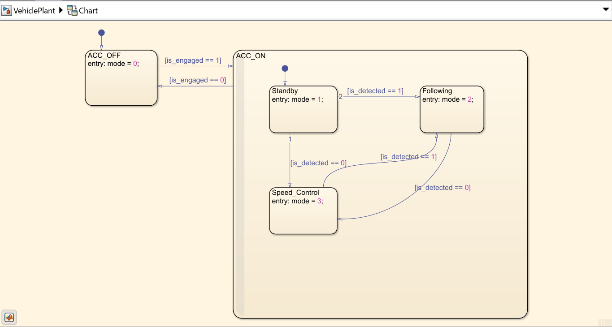
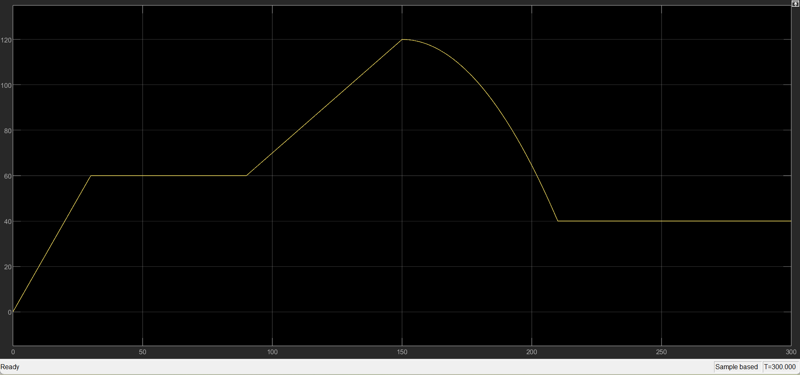
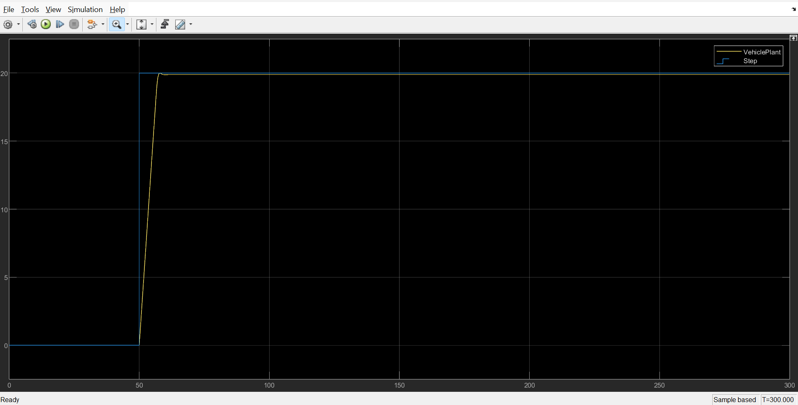
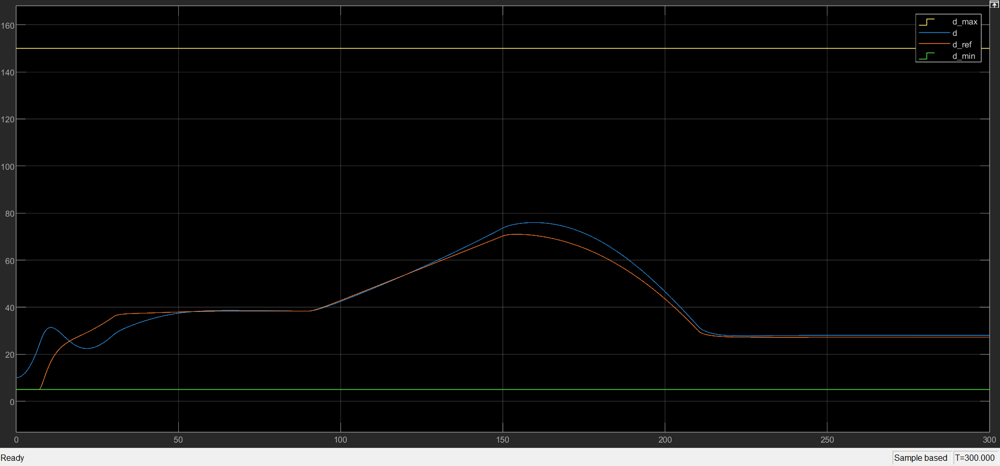
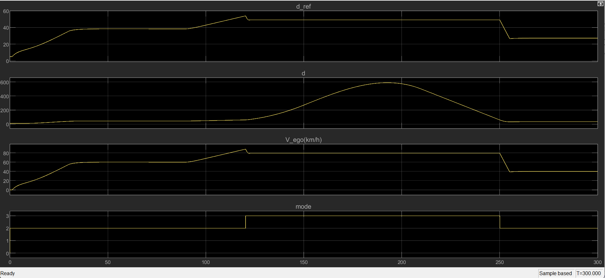

# Adaptive Cruise Control — Model-Based Design
### A complete MPC-based ACC system built from first principles in MATLAB/Simulink

---

## Overview

This project implements a full **Adaptive Cruise Control (ACC)** system using **Model-Based Design (MBD)** in MATLAB/Simulink R2024b. The system controls a vehicle's longitudinal motion by maintaining a target cruise speed when no lead vehicle is present, and a safe following gap when a lead vehicle is detected.

The project was built entirely from first principles — from deriving the vehicle dynamics equations to justifying every design parameter physically. No pre-built Vehicle Dynamics Blockset templates were used for the plant model.

---

## System Architecture

The model consists of three interconnected subsystems:

```
F_driver ──────────────────────────────────────────┐
                                                    ├──► Switch ──► VehiclePlant ──► v_ego
MPC Controller ──► F_traction ─────────────────────┘         ▲                        │
       ▲                                                       │                        │
       │                                                       └────────────────────────┤
  [v_ref; d_ref] ◄── mode ◄── Stateflow                                                 │
  [OV weights]                    ▲                                                      ▼
       │                     is_detected                Environment ◄──────────── v_ego │
  v_lead ──────────────────────────────────────────────────────┘
```

### VehiclePlant
Models longitudinal vehicle dynamics derived from Newton's second law:

$$m\dot{v} = F_{traction} - C_{rr}mg - \frac{1}{2}C_D\rho A_f v^2 - mg\sin(\theta)$$

A static friction model prevents physically incorrect reverse acceleration from rest.

### Environment
Generates the lead vehicle velocity profile (5-phase scenario) and computes the gap dynamics:

$$\dot{d} = v_{lead} - v_{ego}, \quad d(0) = d_0$$

### Stateflow Mode Logic
Hierarchical state machine managing three operating modes:

| Mode | Value | Condition | MPC Objective |
|------|-------|-----------|---------------|
| Standby | 1 | ACC engaged, initializing | Hold current speed |
| Following | 2 | d < d_max (lead detected) | Track d_ref |
| Speed Control | 3 | d ≥ d_max (no lead) | Track v_ref |


*Figure 1: Hierarchical Stateflow state machine*

---

## Design Decisions

### Why MPC over PID?

Within each operating mode, the controller must compute an optimal force 
trajectory subject to physical limits. MPC handles this natively:

- **Input constraints**: F_traction ∈ [−3000, 4500] N are enforced directly 
  inside the QP optimizer — no external saturation or anti-windup logic needed
- **Prediction**: a 5-second lookahead (Np=50 steps) allows anticipatory 
  braking before a gap violation occurs — a PID only reacts to current error
- **Optimality**: at each timestep MPC minimizes a cost function over the full 
  prediction horizon, trading off tracking error against control effort — 
  a PID has no such mechanism

### Why Mode Switching?

With **one manipulated variable** (F_traction) and **two outputs** (v, d), 
simultaneous perfect tracking of both is mathematically impossible — this is 
a fundamental underactuation problem, independent of controller choice.

The physically correct resolution is to make only one objective active at a time:

- When no lead vehicle is detected → gap is undefined → MPC tracks v_ref only 
  (OV weights = [1, 0])
- When lead vehicle is detected → safety dominates → MPC tracks d_ref only 
  (OV weights = [0, 10])

Stateflow implements this switching by changing MPC output weights at runtime 
via the `y.wt` port of the MPC Controller block. ACC 
is by definition a forward-driving system; reverse gear is outside its 
operating envelope and handled entirely by the driver. The v ≥ 0 constraint is 
enforced at the plant level — physically correct, since it is a drivetrain 
limitation rather than a control objective.

### MPC Prediction Model

The MPC requires a **linear** prediction model. The vehicle plant is 
nonlinear due to the aerodynamic drag term v². It is linearized via 
first-order Taylor expansion around a chosen operating point.

#### Nonlinear Plant Equation

From Newton's second law:

$$m\dot{v} = F_{traction} - C_{rr}mg\cos(\theta) - \frac{1}{2}C_D \rho A_f v^2 - mg\sin(\theta)$$

Rewritten as:

$$\dot{v} = g(v, F) = \frac{1}{m}\left(F - C_{rr}mg\cos(\theta) - \frac{1}{2}C_D \rho A_f v^2 - mg\sin(\theta)\right)$$

#### Choice of Operating Point

The Taylor expansion produces a linear model valid in the **neighbourhood** 
of the operating point (v_op, F_op, θ_op). For an ACC system the dominant 
operating regime is **highway cruise** on a nominally flat road. The 
operating point was chosen as:

$$v_{op} = 60 \text{ km/h} = 16.67 \text{ m/s}, \quad \theta_{op} = 0$$

The road grade θ is treated as a **measured disturbance** in the 
full nonlinear plant — the VehiclePlant subsystem accepts θ as an 
input at every timestep. However, for the MPC **prediction model**, 
linearization is performed at θ_op = 0 since highway cruise on flat 
road represents the dominant operating condition. Grade disturbances 
are handled by the MPC's disturbance rejection capability rather than 
being explicitly modelled in the prediction model.

The corresponding steady-state traction force at operating point:

$$F_{op} = C_{rr}mg + \frac{1}{2}C_D \rho A_f v_{op}^2$$

#### Taylor Linearization

The first-order Taylor expansion of g(v, F) around (v_op, F_op, θ_op = 0):

$$\dot{v} \approx g(v_{op}, F_{op}, 0) + \frac{\partial g}{\partial v}\bigg|_{op}(v - v_{op}) + \frac{\partial g}{\partial F}\bigg|_{op}(F - F_{op})$$

Since g(v_op, F_op, 0) = 0 at steady state, computing the partial 
derivatives at θ_op = 0:

$$\frac{\partial g}{\partial v}\bigg|_{op} = -\frac{C_D \rho A_f v_{op}}{m}$$

$$\frac{\partial g}{\partial F}\bigg|_{op} = \frac{1}{m}$$

This gives the linearized velocity dynamics:

$$\dot{v} = -\frac{C_D \rho A_f v_{op}}{m} \cdot v + \frac{1}{m} \cdot F$$

The linearization approximates the nonlinear 
drag term around v_op; the result is a linear model in v and F valid 
in the neighbourhood of highway cruise conditions on flat road.

#### Augmented State-Space Model

The gap dynamics are already linear and require no approximation:

$$\dot{d} = v_{lead} - v_{ego}$$

Combining both equations with state vector x = [v, d]ᵀ, manipulated 
variable u = F_traction, and measured disturbance w = v_lead:

$$\dot{x} = Ax + Bu + Ew$$

$$A = \begin{bmatrix} 
-\frac{C_D \rho A_f v_{op}}{m} & 0 \\ 
-1 & 0 
\end{bmatrix}, \quad 
B = \begin{bmatrix} 
\frac{1}{m} \\ 
0 
\end{bmatrix}, \quad 
E = \begin{bmatrix} 
0 \\ 
1 
\end{bmatrix}$$

**States:** x = [v, d]ᵀ  
**Manipulated variable:** u = F_traction  
**Measured disturbance:** w = v_lead  
**Outputs:** y = Cx = [v, d]ᵀ, where C = I₂

**Note:** The road grade θ acts on the nonlinear plant directly but is 
not included in the prediction model matrices. This is a deliberate 
simplification — for the prediction model, θ_op = 0 is assumed. 
The full nonlinear plant (VehiclePlant subsystem) uses the actual 
θ signal at every timestep, so the closed-loop system responds 
correctly to road grade even though the MPC prediction model does 
not explicitly account for it.

#### Limitation

The prediction model is most accurate near v_op = 60 km/h on flat 
road. At speeds significantly above or below this point — particularly 
during the 120 km/h phase or from standstill — and on steep grades, 
the linearization introduces modelling error. A more robust approach 
would use **gain scheduling** — multiple linear models at different 
operating points — which represents a natural extension of this work.

### MPC Horizon Justification

At each timestep, the MPC solves the following optimization problem:

$$J = \sum_{k=1}^{N_p} \|y(k) - r(k)\|_W^2 + \sum_{k=0}^{N_c-1} \|\Delta u(k)\|_R^2$$

The two horizons serve fundamentally different roles:

- **Prediction horizon Np** defines the evaluation window — how far ahead 
  the controller looks when computing the cost. The tracking error sum runs 
  over all Np steps. A larger Np means more future consequences influence 
  the current control decision.

- **Control horizon Nc** defines the degrees of freedom — how many 
  independent control increments {Δu(0), Δu(1), ..., Δu(Nc-1)} the 
  optimizer actually computes. For k > Nc, the increment is frozen: 
  Δu(k) = 0, meaning u(k) = u(Nc-1) = constant for the remaining 
  Np - Nc steps. This significantly reduces the QP problem size without 
  meaningfully sacrificing control quality, since later control moves 
  have diminishing influence on the cost.

#### Np = 50 steps (5 seconds)

The prediction horizon must cover the worst-case safety-critical event: 
the lead vehicle braking at maximum deceleration from highway speed.

At v_max = 120 km/h = 33.3 m/s with a_max = 8 m/s²:

$$t_{stop} = \frac{v_{max}}{a_{max}} = \frac{33.3}{8} \approx 4.1 \text{ s}$$

The controller must be able to see this entire event within its prediction 
window to plan a safe braking response. At Ts = 0.1 s this requires a 
minimum of 41 steps. Np = 50 was chosen to add a safety margin of ~20% 
above this minimum, giving a 5-second prediction window.

#### Nc = 25 steps (2.5 seconds)

The critical maneuver is not bringing the ego vehicle to a full stop, but 
matching the lead vehicle's velocity — after which the gap stabilizes. 
The velocity-matching time from the same emergency scenario:

$$t_{match} \approx \frac{t_{stop}}{2} \approx 2.0 \text{ s} \approx 20 \text{ steps}$$

Nc = 25 was chosen to cover this maneuver with margin. Beyond step 25, 
the plant dynamics dominate and additional independent control moves 
contribute negligible improvement to the cost while doubling the number 
of QP decision variables. Setting Nc = Np/2 reduces the optimization 
problem size by 50% with minimal loss of control quality.

| Parameter | Value | Justification |
|-----------|-------|---------------|
| Ts | 0.1 s | Captures vehicle dynamics bandwidth (~1-2 Hz) |
| Np | 50 steps (5 s) | Covers worst-case emergency braking event (4.1 s) + margin |
| Nc | 25 steps (2.5 s) | Covers velocity-matching maneuver; halves QP decision variables |
### Dynamic Gap Reference

The following distance reference is velocity-dependent:

$$d_{ref} = v_{ego} \cdot t_{headway} + d_{min}$$

A fixed gap reference would be either dangerously small at high speed or unnecessarily conservative at low speed. This formulation ensures TTC ≥ t_headway at all times.

---

## Vehicle Parameters

| Parameter | Symbol | Value | Unit |
|-----------|--------|-------|------|
| Vehicle mass | m | 1500 | kg |
| Air density | ρ | 1.2 | kg/m³ |
| Frontal area | A_f | 2.1 | m² |
| Drag coefficient | C_D | 0.30 | — |
| Rolling resistance | C_rr | 0.015 | — |
| Time headway | t_headway | 2.0 | s |
| Min standstill gap | d_min | 5 | m |
| Radar range | d_max | 150 | m |

---

## Lead Vehicle Scenario

A 5-phase velocity profile exercises all critical ACC behaviors:

| Phase | Time | v_lead | Behavior Tested |
|-------|------|--------|----------------|
| 1 | 0–30 s | 0 → 60 km/h | Acceleration from rest |
| 2 | 30–90 s | 60 km/h | Speed holding |
| 3 | 90–150 s | 60 → 120 km/h | Following acceleration |
| 4 | 150–210 s | 120 → 40 km/h | **Critical braking scenario** |
| 5 | 210–300 s | 40 km/h | Gap stabilization |


*Figure 2: The leading vehicle velocity profile.*

---

## Results

### Speed Control Mode
v_ego tracking a step reference of 20 m/s from rest. Clean first-order response with no overshoot after weight tuning.


*Figure 3: F_traction (top) and v_ego (bottom) in Speed Control mode. v_ego settles exactly at v_ref = 20 m/s.*

---

### Following Mode
Gap tracking with dynamic d_ref = v_ego · t_headway + d_min. The MPC maintains the following distance throughout all 5 phases of the lead vehicle scenario.


*Figure 4: d_ref (top) and d (bottom) in Following mode. Gap tracks reference closely and remains always positive.*

---

### Full System with Mode Switching
Complete simulation showing Stateflow mode transitions driven by gap distance relative to radar detection range. d_max = 100m, v_ref = 80km/h


*Figure 5: d_ref, d, v_ego (km/h), and mode signal. Mode switches between Following (2) and Speed Control (3) based on d vs d_max.*

---

## How to Run

### Prerequisites
- MATLAB R2024b
- Simulink
- Model Predictive Control Toolbox
- Stateflow
- Embedded Coder (optional)

### Steps

```matlab
% 1. Open MATLAB and navigate to the project folder
cd('path/to/adaptive-cruise-control')

% 2. Load vehicle and MPC parameters
run('scripts/parameters.m')

% 3. Build the MPC prediction model and controller object
run('scripts/MPC_linear_model.m')

% 4. Open and run the Simulink model
open_system('model/VehiclePlant.slx')
sim('model/VehiclePlant.slx')
```

---

## Project Structure

```
adaptive-cruise-control/
├── model/
│   └── VehiclePlant.slx          # Complete Simulink model
├── scripts/
│   ├── parameters.m               # Vehicle and MPC parameters
│   └── MPC_linear_model.m         # State-space model and MPC object
├── docs/
│   └── MPC_Design_Parameters.pdf  # Detailed parameter justification report
├── images/
│   ├── stateflow_chart.png
│   ├── speed_control_result.png
│   ├── following_mode_result.png
│   └── full_system_result.png
└── README.md
```

---

## Key Engineering Insights

**On the 1-input 2-output problem:** With only F_traction as the manipulated variable, simultaneous perfect tracking of both speed and gap is mathematically impossible. The mode-switching architecture resolves this by making only one objective active at a time — a physically correct and practically elegant solution.

**On static friction:** Rolling resistance only opposes motion when v > 0. At rest, the net force cannot be negative — the vehicle stays stationary until traction exceeds the static friction threshold. This was implemented with a conditional logic block in Simulink.

**On linearization:** The nonlinear drag term v² was linearized around v_op = 60 km/h using Taylor expansion. The prediction model is therefore most accurate near highway cruise conditions, which represents the dominant operating regime for ACC.

---

## Author

**Hassan Gholami**
Control & Automation Engineer — Milan, Italy
[LinkedIn](https://linkedin.com/in/gholami-hassan) | [Email](mailto:m.gholami.derouei@gmail.com)
